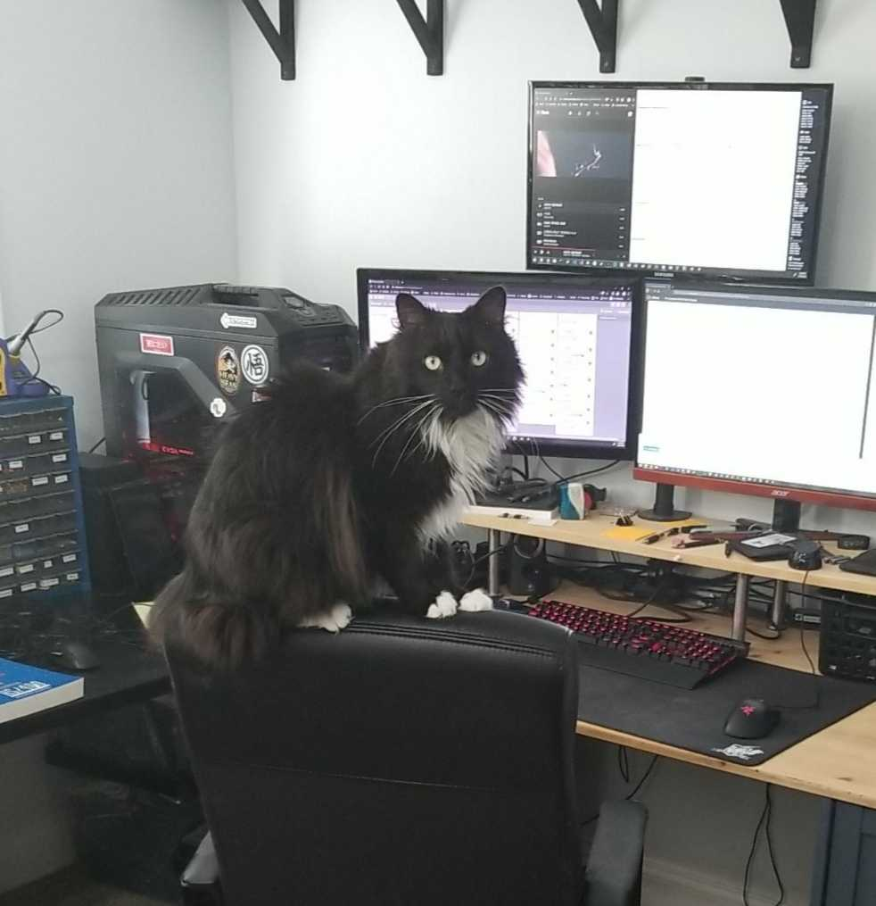

# Ranger-Lang
A programming language designed while studying compilers and taking heavy inspiration from RPGLE and C grammars.
Compiles RangerLang source to a pseudo-assembly language for a simple VM called RangerVM..


## About
This language was my introduction to the world of compilers. 


The goal of writing this was to learn, so there's not a lot of interesting stuff implemented. 
Additionally, I wimped out and didn't dive into functions. 
So, I did miss out on a lot of good stuff about activation records, heap management, etc.
In the future, I will make a full blown object oriented language to fill in the missing knowledge and more.

I started out making a dumber version of C's grammar, but decided for ease of parsing I would take RPGLE's method of code blocks (if -> endif, dow -> enddo).
I've been studying RPGLE lately and the simple grammar just makes sense as a good starting point for writing an introductory language.


<figure>
  <p align="center">
    
    <figcaption>
      <p align="center">RangerLang is named after my cat that always hangs out in my room while I code.</p>
    </figcaption>
  </p>
</figure>


## Features
The full context free grammar can be found in **RangerLang.ebnf**.
But, I will briefly list the sparse features I implemented:
- [x] Integer variables
- [x] Base operators - ```+ - / * < > = :=```
- [x] If/else 
- [x] Do while
- [x] Read integer from STDIN
- [x] Write integer to STDOUT


## Stretch Features
Every side project starts out fun, but later becomes stale; We'll see if I get here.
If not, I'm sure the next language I make will have these and more.

- [ ] Additional relational operators - ```!=, >=, <=```
- [ ] Additional binary operators - ```&&, ||```
- [ ] Unary operators - ```!, +, -```
- [ ] Strict type definition - new keywords ```int, float, string```
- [ ] Additional data types - float, string
- [ ] Integer arrays


## Compilation Example
Examples can be found in **tests/**.

#### Source program (RangerLang) - **fibonacci.rg**
```php
/* Compute fibonacci number using iterative method 
     since my language does not have functions.
*/
read n;
fib := 1;

if(n > 1);
  temp := 0;
  prev := 1;
  i := 2;

  dow(i < (n-1));
    temp := fib;
    fib := fib + prev;
    prev := temp;
    i := i + 1;
  enddo;
endif;

write fib;
```

#### Target program (RangerVM Assembly Language) - **fibonacci.asm**
Psuedo-assembly meant to mimic how a ROM would work...all opcodes listed in **opcodes.asm**

```assembly
; RangerLang compilation to RangerVM Assembly
; File: /home/barrett/Programming/Repos/Ranger-Lang/tests/fibonacci.rg
;  
; START PRELUDE:
  0:     LDM   R6,0[R0] 		; load maxaddress from address 0
  1:     STM   R0,0[R0] 		; clear address 0
; END PRELUDE
  2:      IN   R0,R0,R0 		; read integer value
  3:     STM   R0,0[R5] 		; read: store value
  4:     LDI   R0,1[R0] 		; load constant
  5:     STM   R0,1[R5] 		; assign: store value
; IF
  6:     LDM   R0,0[R5] 		; load identifier value
  7:     STM   R0,0[R6] 		; operator: push left
  8:     LDI   R0,1[R0] 		; load constant
  9:     LDM   R1,0[R6] 		; operator: load left
 10:     SUB   R0,R1,R0 		; operator >
 11:     JGT   R0,2[R7] 		; branch if true
 12:     LDI   R0,0[R0] 		; it was false
 13:     LDA   R7,1[R7] 		; unconditioned jump
 14:     LDI   R0,1[R0] 		; it was true
 16:     LDI   R0,0[R0] 		; load constant
 17:     STM   R0,2[R5] 		; assign: store value
 18:     LDI   R0,1[R0] 		; load constant
 19:     STM   R0,3[R5] 		; assign: store value
 20:     LDI   R0,2[R0] 		; load constant
 21:     STM   R0,4[R5] 		; assign: store value
; DOW
 22:     LDM   R0,1[R5] 		; load identifier value
 23:     STM   R0,2[R5] 		; assign: store value
 24:     LDM   R0,1[R5] 		; load identifier value
 25:     STM   R0,0[R6] 		; operator: push left
 26:     LDM   R0,3[R5] 		; load identifier value
 27:     LDM   R1,0[R6] 		; operator: load left
 28:     ADD   R0,R1,R0 		; operator +
 29:     STM   R0,1[R5] 		; assign: store value
 30:     LDM   R0,2[R5] 		; load identifier value
 31:     STM   R0,3[R5] 		; assign: store value
 32:     LDM   R0,4[R5] 		; load identifier value
 33:     STM   R0,0[R6] 		; operator: push left
 34:     LDI   R0,1[R0] 		; load constant
 35:     LDM   R1,0[R6] 		; operator: load left
 36:     ADD   R0,R1,R0 		; operator +
 37:     STM   R0,4[R5] 		; assign: store value
 38:     LDM   R0,4[R5] 		; load identifier value
 39:     STM   R0,0[R6] 		; operator: push left
 40:     LDM   R0,0[R5] 		; load identifier value
 41:     STM   R0,-1[R6] 		; operator: push left
 42:     LDI   R0,1[R0] 		; load constant
 43:     LDM   R1,-1[R6] 		; operator: load left
 44:     SUB   R0,R1,R0 		; operator -
 45:     LDM   R1,0[R6] 		; operator: load left
 46:     SUB   R0,R0,R1 		; operator <
 47:     JLT   R0,2[R7] 		; branch if true
 48:     LDI   R0,0[R0] 		; it was false
 49:     LDA   R7,1[R7] 		; unconditioned jump
 50:     LDI   R0,1[R0] 		; it was true
 51:     JEQ   R0,-30[R7] 		; dow: jump back to start
; ENDDO
 15:     JEQ   R0,37[R7] 		; if: jump to else
 52:     LDA   R7,0[R7] 		; jump to end
; ENDIF
 53:     LDM   R0,1[R5] 		; load identifier value
 54:     OUT   R0,R0,R0 		; write AC
; END PROGRAM
 55:    HALT   R0,R0,R0 		; 

```

#### Compile Listing - **fibonacci.listing.txt**
Compile listing with parser debugging turned on (for syntax tree)

```
RangerLang Compile Listing for 
    /home/barrett/Programming/Repos/Ranger-Lang/tests/fibonacci.rg

Source Program:
0001: /* Compute fibonacci number using iterative method 
0002:      since my language does not have functions.
0003: */
0004: 
0005: read n;
0006: fib := 1;
0007: 
0008: if(n > 1);
0009:   temp := 0;
0010:   prev := 1;
0011:   i := 2;
0012: 
0013:   dow(i < (n-1));
0014:     temp := fib;
0015:     fib := fib + prev;
0016:     prev := temp;
0017:     i := i + 1;
0018:   enddo;
0019: endif;
0020: 
0021: write fib;

Syntax Tree:
  Read: n
  Assignment: fib
    Literal: 1
  If
    Operator: >
      Identifier: n
      Literal: 1
    Assignment: temp
      Literal: 0
    Assignment: prev
      Literal: 1
    Assignment: i
      Literal: 2
    Dow
      Operator: <
        Identifier: i
        Operator: -
          Identifier: n
          Literal: 1
      Assignment: temp
        Identifier: fib
      Assignment: fib
        Operator: +
          Identifier: fib
          Identifier: prev
      Assignment: prev
        Identifier: temp
      Assignment: i
        Operator: +
          Identifier: i
          Literal: 1
  Write
    Identifier: fib

Building symbol table...

Symbol Table:

Symbol         Address     Reference(s)
-----------    --------    ------------
temp           2           0009 0014 0016 
fib            1           0006 0014 0015 0021 
i              4           0011 0013 0017
n              0           0005 0008 0013 
prev           3           0010 0015 0016 

Checking types...

Generating code...

DONE.
```


#### Output
The output from running ```./rangervm fibonacci.asm```
```
RangerVM Started.
Loading /home/barrett/Programming/Repos/Ranger-Lang/tests/fibonacci.asm into ROM
IN:  10
OUT: 55
Executed 255 instruction(s)
PGM HALTED
RangerVM Ended.
```


## Commands
* Compile a single RangerLang source file - ```./rangerlang ../tests/fibonacci.rg```
* Run RangerVM assembly - ```./rangervm ../tests/fibonacci.asm```
* Build and test compile all example files - ```./test.sh```


## References
* EBNF
  * https://en.wikipedia.org/wiki/Extended_Backus%E2%80%93Naur_form
  * https://tomassetti.me/ebnf/
* Books
  * Compilers: Principles, Techniques, and Tools (The Dragon Book)
  * Engineering A Compiler
  * SubC Compiler - http://www.t3x.org/subc/
  * Crafting Interpreters - http://craftinginterpreters.com/
* Misc
  * Dangling else - https://en.wikipedia.org/wiki/Dangling_else
  * Pratt Parsing (operator precedence) - https://journal.stuffwithstuff.com/2011/03/19/pratt-parsers-expression-parsing-made-easy/
  * x86 64-bit assembly reference - https://www.felixcloutier.com/x86/

  
